# Ex-08-Data-Visualization-

## AIM
To Perform Data Visualization on a complex dataset and save the data to a file. 

# Explanation
Data visualization is the graphical representation of information and data. By using visual elements like charts, graphs, and maps, data visualization tools provide an accessible way to see and understand trends, outliers, and patterns in data.

# ALGORITHM
### STEP 1
Read the given Data
### STEP 2
Clean the Data Set using Data Cleaning Process
### STEP 3
Apply Feature generation and selection techniques to all the features of the data set
### STEP 4
Apply data visualization techniques to identify the patterns of the data.


# CODE:
```
import pandas as pd
import numpy as np
df=pd.read_csv("Superstore.csv")

df.head()

#Data Visualization using Seaborn

import seaborn as sns
from matplotlib import pyplot as plt

#1.Line plot

plt.figure(figsize=(8,5))
sns.lineplot(x="Segment",y="Region",data=df,marker='o')
plt.xticks(rotation = 90)
sns.lineplot(x='Ship Mode',y='Category', hue ="Segment",data=df)
sns.lineplot(x="Category",y="Sales",data=df,marker='o')

#2.Scatterplot

sns.scatterplot(x='Category',y='Sub-Category',data=df)
sns.scatterplot(x='Category', y='Sub-Category', hue ="Segment",data=df)
plt.figure(figsize=(10,7))
sns.scatterplot(x="Region",y="Sales",data=df)
plt.xticks(rotation = 90)

#3.Boxplot

sns.boxplot(x="Sub-Category",y="Discount",data=df)
sns.boxplot( x="Profit", y="Category",data=df)

#4.Barplot

sns.barplot(x="Sub-Category",y="Sales",data=df)
plt.xticks(rotation = 90)
sns.barplot(x="Category",y="Sales",data=df)
plt.xticks(rotation = 90)

#5.Pointplot

sns.pointplot(x=df["Quantity"],y=df["Discount"])

#6.Count plot

sns.countplot(x="Category",data=df)
sns.countplot(x="Sub-Category",data=df)

#7.Histogram

sns.histplot(data=df,x ='Ship Mode',hue='Sub-Category')

#8.KDE Plot

sns.kdeplot(x="Profit", data = df,hue='Category')

#Data Visualization Using MatPlotlib

#1.Plot

plt.plot(df['Category'], df['Sales'])
plt.show()

#2.Heatmap

df.corr()
plt.subplots(figsize=(12,7))
sns.heatmap(df.corr(),annot=True)

#3.Piechart

df1=df.groupby(by=["Ship Mode"]).sum()
labels=[]
for i in df1.index:
    labels.append(i)
colors=sns.color_palette("bright")
plt.pie(df1["Sales"],labels=labels,autopct="%0.0f%%")
plt.show()

df3=df.groupby(by=["Category"]).sum()
labels=[]
for i in df3.index:
    labels.append(i) 
plt.figure(figsize=(8,8))
colors = sns.color_palette('pastel')
plt.pie(df3["Profit"],colors = colors,labels=labels, autopct = '%0.0f%%')
plt.show()

#4.Histogram

plt.hist(df["Sub-Category"],facecolor="peru",edgecolor="blue",bins=10)
plt.show()

#5.Bargraph

plt.bar(df.index,df['Category'])
plt.show()

#6.Scatterplot

plt.scatter(df["Region"],df["Profit"], c ="blue")
plt.show()              

#7.Boxplot

plt.boxplot(x="Sales",data=df)
plt.show()
```

# OUPUT:

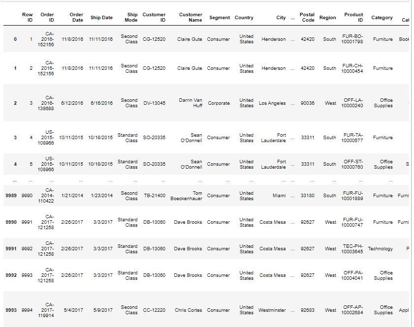
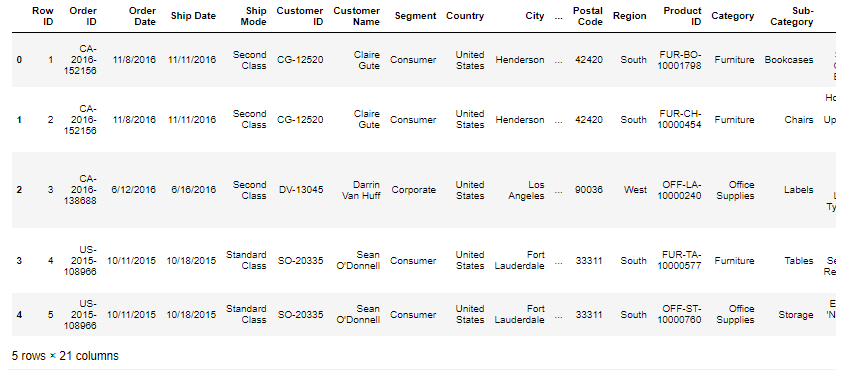
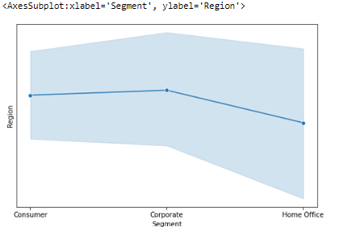


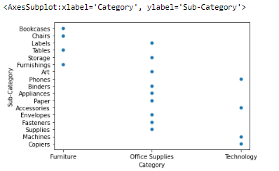


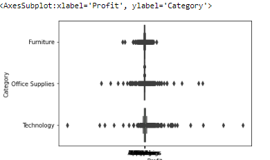
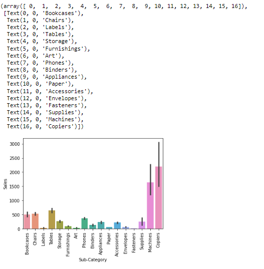
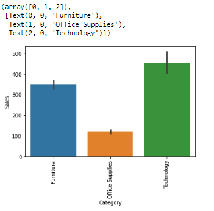
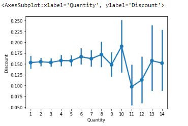
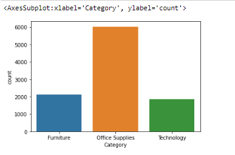
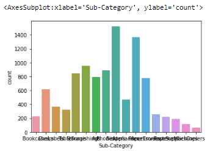
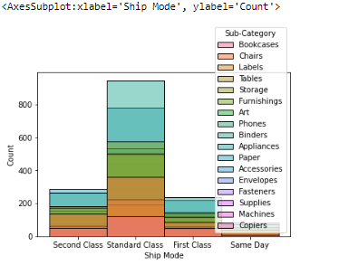

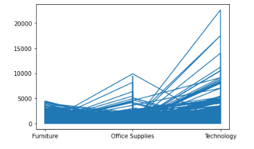

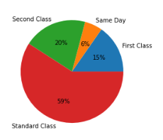
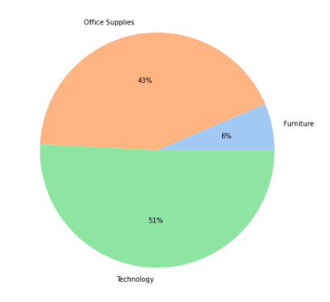

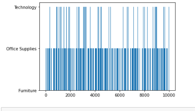
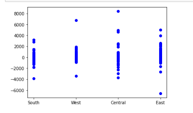
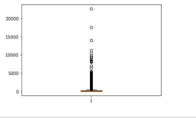


# Result:
Data Visualization on a complex dataset and save the data to a file has been performed.